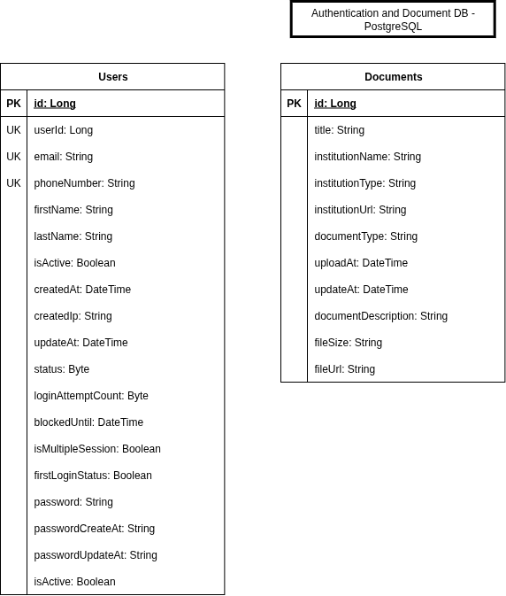

# Documentation Management Backend

# Content
- [Documentation Management Backend](#documentation-management-backend)
- [Content](#content)
- [Installation](#installation)
- [Todos](#todos)
- [API Documentation](#api-documentation)
- [Databases (Schema, Design, etc.)](#databases-schema-design-etc)
- [Quick Start](#quick-start)
- [Test](#test)

# Installation

TODO

# Todos

* [x] API Design and Architecture
* [x] Request and Response Implementation
* [x] Request-Response Architecture Design
* [x] Update Mapper Module for Every Entities
* [x] Validation
* [ ] DevOps
* [ ] Logging
* [x] Add Logout Endpoint
* [x] Message Standarts
* [ ] Update Test (Unit Test, etc.)
  * [ ] There are some errors in tests

# API Documentation

TODO

# Databases (Schema, Design, etc.)




```yml
spring:
  datasource:
    url: jdbc:postgresql://localhost:5432/docappdb
    username: postgres
    password: postgres
    driver-class-name: org.postgresql.Driver

  jpa:
    database-platform: org.hibernate.dialect.PostgreSQLDialect
    hibernate:
      ddl-auto: update
    show-sql: true

  servlet:
    multipart:
      max-file-size: 50MB
      max-request-size: 50MB
      enabled: true

# MinIO Configuration
minio:
  endpoint: http://localhost:9000
  access-key: minioadmin
  secret-key: minioadmin
  bucket-name: your-bucket-name
```

# Quick Start

```
sudo docker build -t doc-man-app-backend .
```

```
sudo docker compose up --build -d
```

# Test

File Path: **src/test/resources/application-test.properties**

```properties
# Test Database Configuration - H2 In-Memory Database
spring.datasource.url=jdbc:h2:mem:testdb;MODE=PostgreSQL;DATABASE_TO_LOWER=TRUE;DEFAULT_NULL_ORDERING=HIGH
spring.datasource.driver-class-name=org.h2.Driver
spring.datasource.username=sa
spring.datasource.password=

# JPA Configuration for Tests
spring.jpa.hibernate.ddl-auto=create-drop
spring.jpa.show-sql=false
spring.jpa.properties.hibernate.format_sql=true
spring.jpa.database-platform=org.hibernate.dialect.H2Dialect
spring.jpa.defer-datasource-initialization=true

# Disable Spring Security for tests
spring.autoconfigure.exclude=org.springframework.boot.autoconfigure.security.servlet.SecurityAutoConfiguration,org.springframework.boot.autoconfigure.security.servlet.UserDetailsServiceAutoConfiguration

# H2 Console (for debugging if needed)
spring.h2.console.enabled=true

# Logging Configuration for Tests
logging.level.com.moneymate=INFO
logging.level.org.hibernate.SQL=DEBUG
logging.level.org.springframework.security=OFF

# Test specific configurations
spring.test.database.replace=any
```